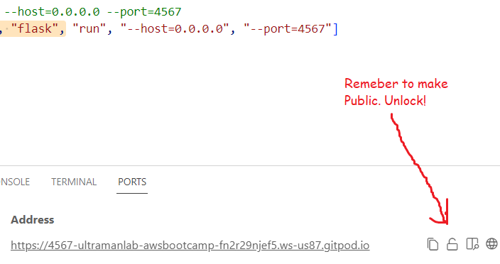

# Week 1 — App Containerization

## $${\color{white}\space Solo \space Yo:\color{blue}Ultra \space Man \space (Tony)}$$ 

# Progress and "Ah-ha" notes to self
| *********************** |
| --- | 
| * Writing two docker files |
| * Success with Docker files running |
| * Success with Docker files working together |
| * After an intial hiccup, was able to get Docker files working together with Docker Compose |
| * In GitPod Dev, identified and understood inside outside container processes of Dockerfile |
| * Containerized Backend -- Got JSON from https://4567-ultramanlab-awsbootcamp-fn2r29njef5.ws-us87.gitpod.io/api/activities/home |
| * Successfully built Frontend and Backend Docker containers |
| * Remembered to make port 4567 public by unlocking padlock icon |

| ---------------------------------------------------------------------------------------------------------------------------------- | 
| * Fascinating how Docker Composer runs multiple containers simultaneously |
| * Ran into a CORS error, resolved by restarting workspace |
| * Fascinating the Docker Composer runs multiple containers simultaneously |

