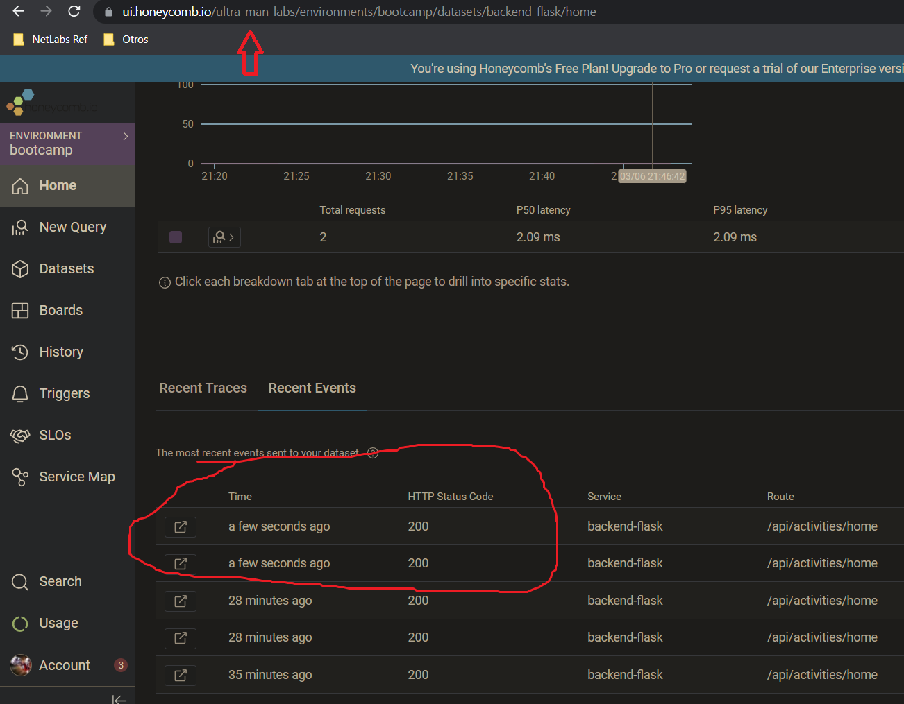
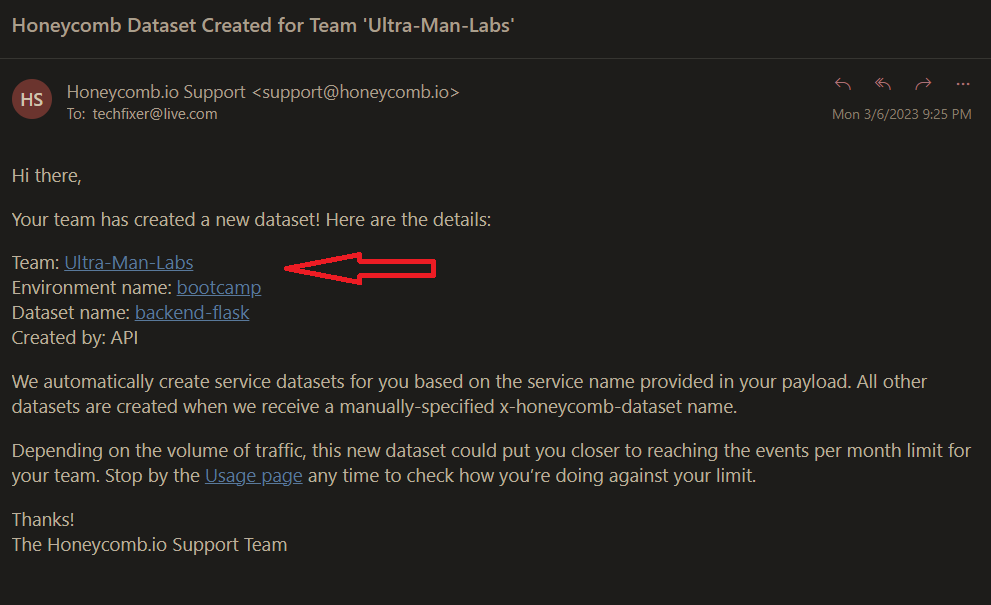
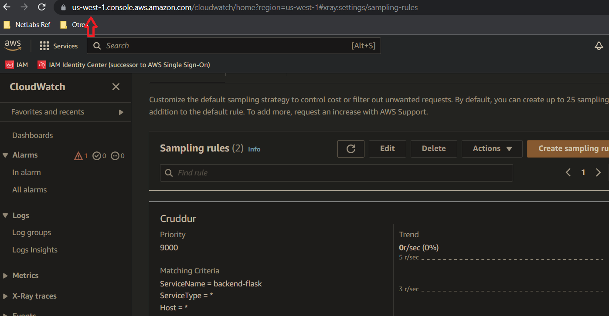
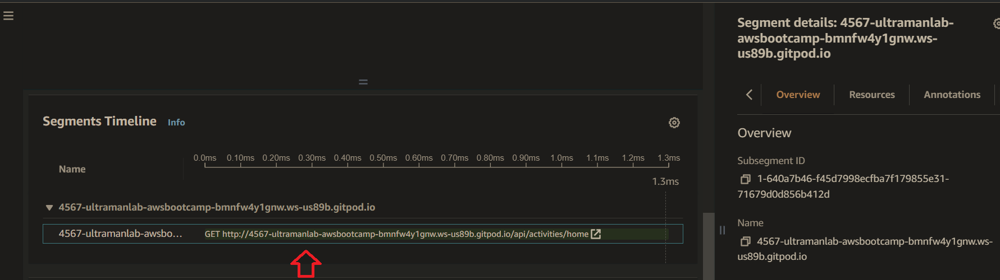
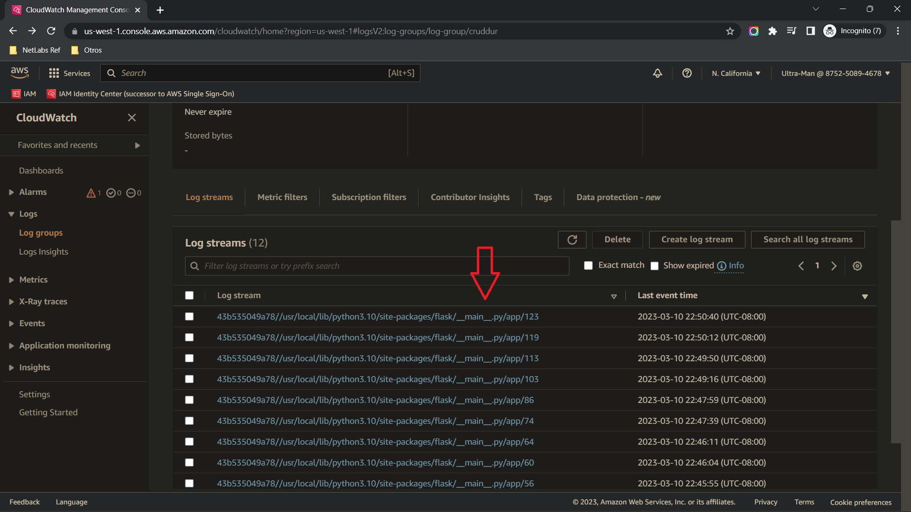

# Week 2 — Distributed Tracing

## Ultra Man (Tony)

# Progress/reference and "Ah-ha" notes to self
| *********************** |
| --- |
| * [Field Notes](https://github.com/ultraman-labs/aws-bootcamp-cruddur-2023/blob/main/_docs/assets/week2/Notes-Week2.txt) |
| --- |
| * After much troubleshooting, successfully produce a backend trace sent from cruddur|
| --- |
| *  |
| --- |
| * Received HonyComb email confirmation of trace from the backend-flask dataset|
| --- |
| *  |
| * ---|
| * Verifying Cruddur sampling rule
| *  |
| * --- |
| * Xray daemon port 200 was available but not being served, i.e, not open. The issue was that the environmental AWS region varialble, in docker-compose.yml fiel, was        referencing this variable as "AWS_REGION", instead of "AWS_DEFAULT_REGION'. A small code fix victory for me! |
| * --- |
| * Segment from Cruddur |
| *  |
| * --- |
| * Impement CloudWatch Logs |
| *  |
| * --- |
| *--- |
| ---------------------------------------------------------------------------------------------------------------------------------- |
| * ---|
| * --- |
| * --- |
| --- |

