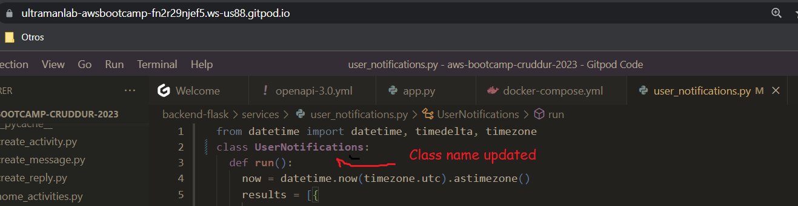
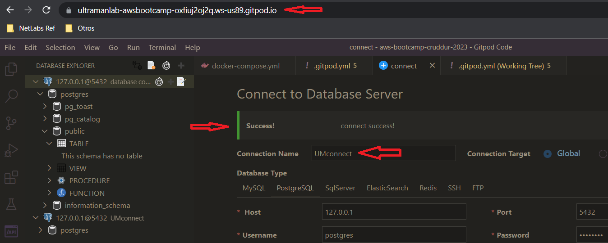
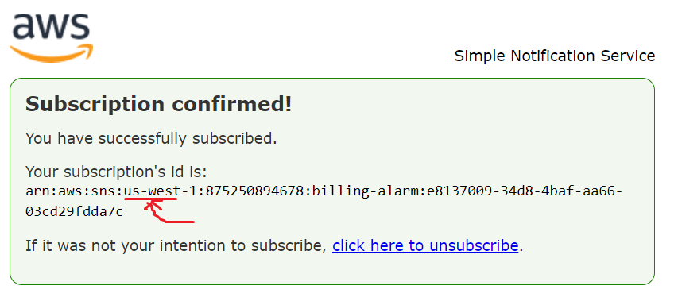
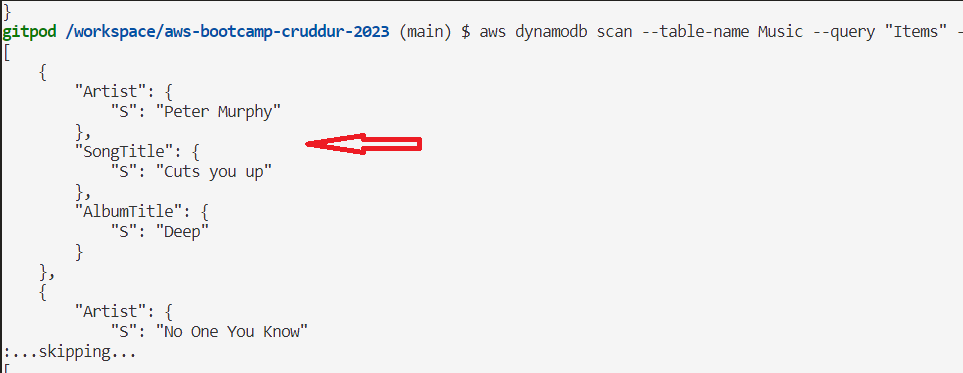

# Week 2 — Distributed Tracing

## Ultra Man (Tony)

# Progress/refernce and "Ah-ha" notes to self
| *********************** |
| --- |
| *  |
| --- |
| * After much troubleshooting, successfully produce a backend trace sent from cruddur|
| --- |
| *  |
| --- |
| * Received HonyComb email confirmation of trace from the backend-flask dataset|
| --- |
| *  |
| * ---|
| * --- |
| * --- |
| * --- |
| * --- |
| * --- |
| * --- |
| *--- |
| ---------------------------------------------------------------------------------------------------------------------------------- |
| * ---|
| * --- |
| * --- |
|  |
| * Discovered how to toggle the mini-map in GitPod |
| * Endpoint for notifications tab. Resolved issue of "user_notification.py" module not found. Extra blank space after extension was the issue. |
| --- |
## * NameError ... trying to figure out how to trace "UserNotifications" not defined error.  
|  |
## * Resolved. Within "user_notifications.py" file, the "class"  was not defined with the correct name of "UserNotifications"
|  |
## Success. Rendered JSON structured data with intended string changes
|  |
| --- |
## Created the FrontEnd user notifications tab
|  |
| --- |
postgresclient.png
## Established db connection
|  |
| --- |
## Had to circle back and recreate the credentials for the IAM user and confirm subscripiton. My error was using the access keys of a different user. All good now.
|  |
| --- |
## Retrieved records (two music artist)
|  |
| --- |
## Verified postgres client is working
|  |
| --- |

