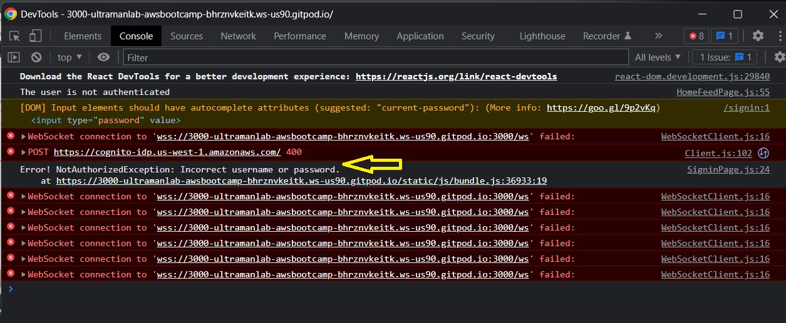
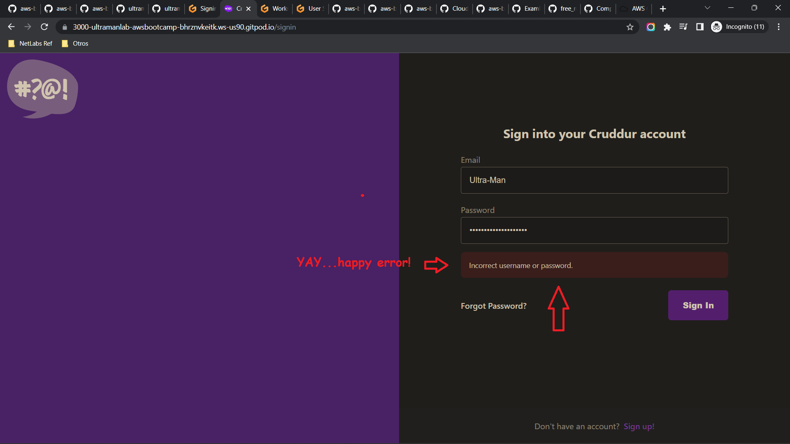
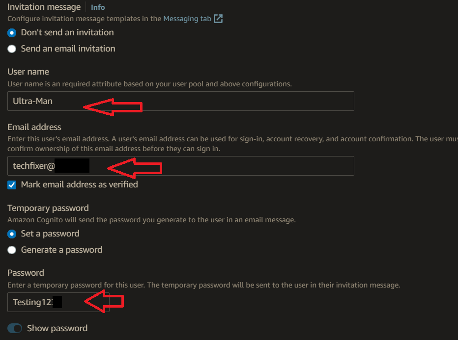
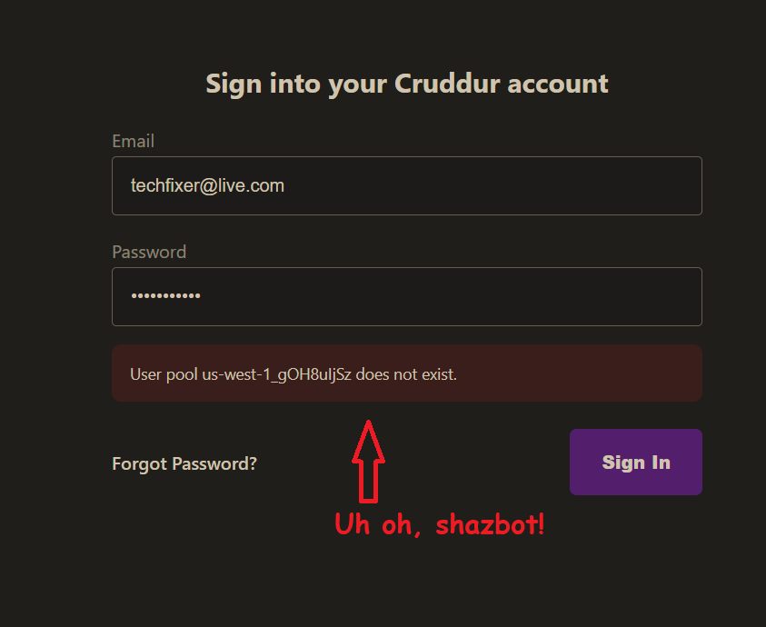
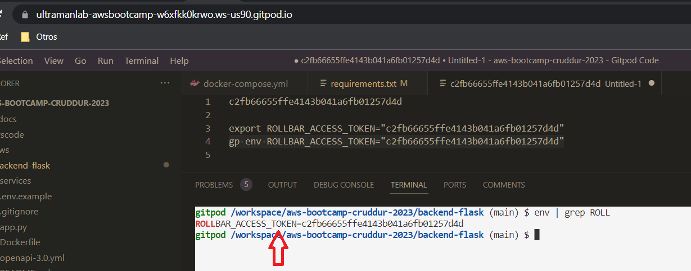
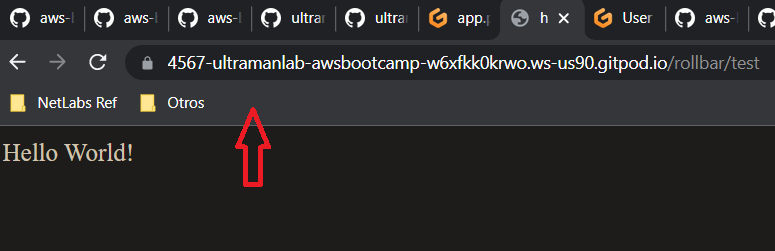
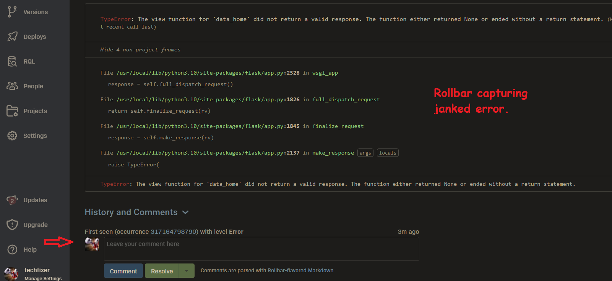

# Week 3 — Decentralized Authentication

## Ultra Man (Tony)

# Progress/reference and "Ah-ha" notes to self
| *********************** |
| --- |
| * [Field Notes](https://github.com/ultraman-labs/aws-bootcamp-cruddur-2023/blob/main/_docs/assets/week3/Notes-Week3.txt) |
| --- |
| * Using Chrome's DevTools to troubleshoot un-authenticated user |
| --- |
| *  |
| --- |
| * Received the expected signin error, now time to setup Cognito user and user pool.|
| --- |
| *  |
| * ---|
| * Creating user in AWS Cognito
| * ---|
| *  |
| * --- |
  * Wow! In the sign-in page of Cruddur, I was receiving an error of "User pool us-west-1_gOH8uljSz does not exist."  
    This threw me good! I initially thought to look in the docker-compose.yml file for code line that referenced  
    the "REACT_APP_AWS_USER_POOLS_ID" environment variable-- which contained the prior "User pool ID" that AWS 
    Cognito generated. After updating this variable, I went back and restarted the docker-compose.ym file. But 
    the sign-in error persisted. Hmmm...what the strange tacos was going on!? Okay, somehow I made the cerbral 
    leap of thinking that perhaps the REACT_APP_CLIENT_ID env var had change as well--- well it did! So I  
    grabbed (copied) the new Client ID that Cognito generated, and updated the pertinent variable in docker-compose.yml 
    Restarted the docker file and voila! After going back to the Cruddur sign-in page I was able to log in! 
   

| * --- |
| * Impement CloudWatch Logs |
| *  |
| * --- |
| *Confirming RollBar Access Token in GitPod |
| *  |
| * ---|
| * Rollbar backend endpoint working |
| *  |
| * --- |
| * Rollbar capturing janked error |
| *  |
| * --- |
| --- |

