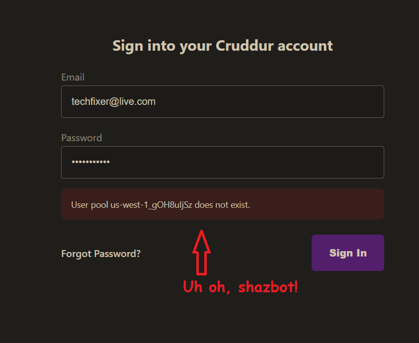

# Week 4 — Postgres and RDS

## Ultra Man (Tony)

# Progress/reference and "Ah-ha" notes to self.
| *********************** |
| --- |
| * [Field Notes](https://github.com/ultraman-labs/aws-bootcamp-cruddur-2023/blob/main/_docs/assets/week4/Notes-Week4.txt) |
| --- |
| ** Created the Cruddur DB instance |
| --- |
| *  |
| --- |
| ** Verifying the availbility zone for my region.|
| --- |
| *  |
| * ---|
| ** Creating user in AWS Cognito
| * ---|
| *  |
| * --- | 

 ---    
    ** Wow! In the sign-in page of Cruddur, I was receiving an error of "User pool us-west-1_gOH8uljSz does not exist."  
       This threw me good! I initially thought to look in the docker-compose.yml file for code line that referenced  
       the "REACT_APP_AWS_USER_POOLS_ID" environment variable-- which contained the prior "User pool ID" that AWS  
       Cognito generated. After updating this variable, I went back and restarted the docker-compose.ym file. But  
       the sign-in error persisted. Hmmm...what the strange tacos was going on!? Okay, somehow I made the cerbral  
       leap of thinking that perhaps the REACT_APP_CLIENT_ID env var had change as well--- well it did! So I grabbed  
       (copied) the new Client ID that Cognito generated, and updated the pertinent variable in docker-compose.yml  
       Restarted the docker file and voila! After going back to the Cruddur sign-in page I was able to log in! 

    
           
   ---
  >> ** Confirming that, after authenticating, the preferred user name atribute from Cognito was passed onto the Cruddur app.   
       
   
      
---

 >> ** Received email confirmaition code.     
  
 
       
 ---   
 
 >> ** Cruddur prompting to enter confirmation code sent to my email.     
  
 
       
 ---
>> ** In Cognito, verifying the status of of the user account as enabled and user email as confirmed.     
       

      
 ---
>> ** Testing Cruddur's password recovery page. It Worked!     
  

      
 ---

>> ** Successfully resetting user password.     
  

      
 ---   
