# Week 5 — DynamoDB and Serverless Caching

## Ultra Man (Tony)

# Progress/reference and "Ah-ha" notes to self.
| *********************** |
| --- |
| * [Field Notes](https://github.com/ultraman-labs/aws-bootcamp-cruddur-2023/blob/main/_docs/assets/week5/Notes-Week5.txt) |
| --- |
| ** Backend directory cleanup. |
| --- |
| *  |
| --- |
| ** Updating seed file user handles.|
| --- |
| *  |
| * ---|
| ** Creating DB and loading schema.
| * ---|
| *  |
| * --- | 

 ---    
    **Seeding messages  

    
           
   ---
  >> ** Running data scan.   
       
   
      
---

 >> ** Retrieving conversations.     
  
 
       
 ---   
 
 >> ** Time format error.     
  
 
       
 ---
>> ** Resolving the time format error.     
       

      
 ---
>> ** Listing users.     
  

      
 ---

>> ** Exporting environmental variables.     
  

      
 --- 
 
 >> ** Changing file permissions.     
  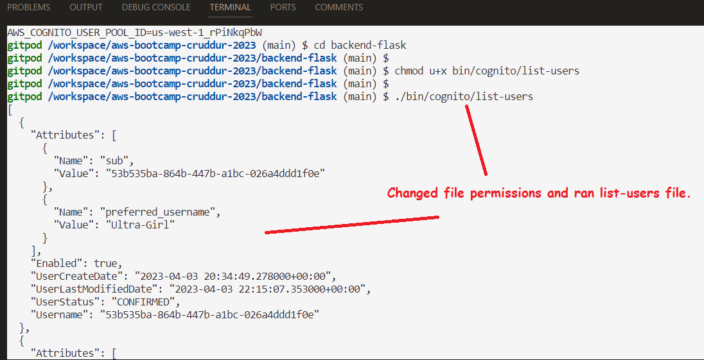

      
 --- 

>> ** Updating Cognito users ids and generating its output.     
  

      
 --- 
 
 >> ** Error that "setCognitoErrors" is undefined.     
  

      
 --- 
 
 >> ** Resolved setCognitoErrors, with code change shown in pic.     
  

      
 ---

 >> ** The cause of this error was the referencing to a bash script.     
  

      
 ---

 >> ** Resolved this error by moving the file to the correct directory .     
  

      
 ---

---

 >> ** Andrew explained this error, and the temp fix is to re-login.     
  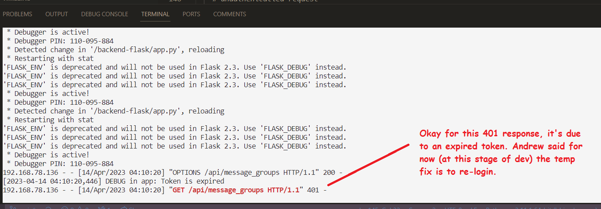

      
 ---
 
 ---

 >> ** Hmmm...the endpoint_url can not be found. The outputted suggestion is that this is a syntax error.     
  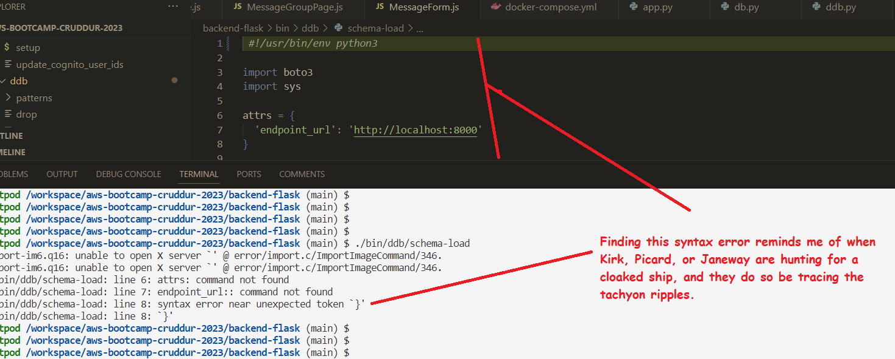

      
 ---
 
 >> ** Some times looking for the simple things can be the answer. In this case, it was an extra blank space.     
  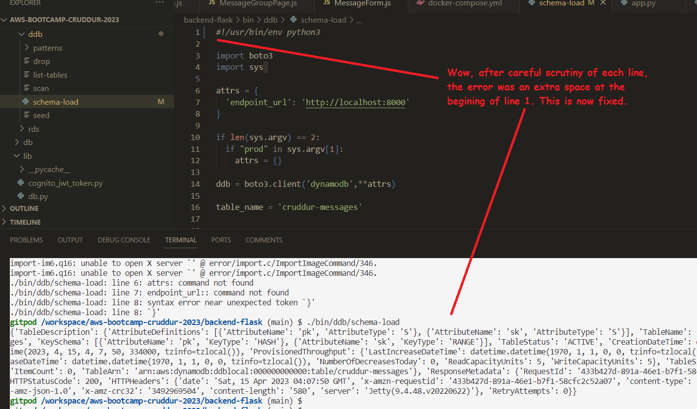

      
 ---
 
 >> ** Debugging this Unhandled thrown error when loading Londo new message.     
  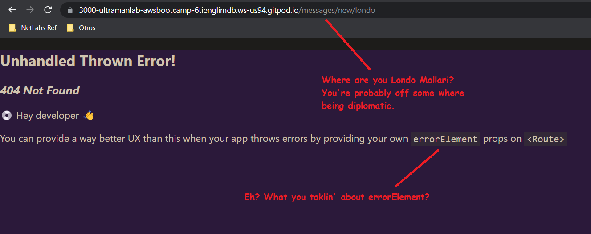

      
 ---
 
 >> ** The solution was adding the path and element to the App.js.     
  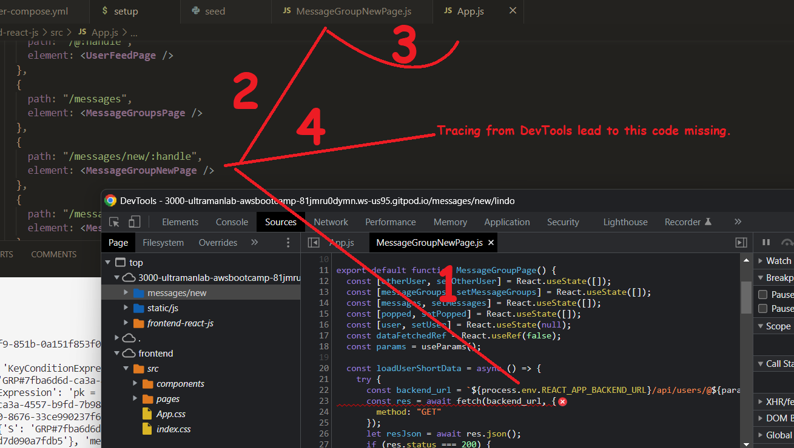

      
 ---
 
 >> ** Creating the VPC endpoint     
  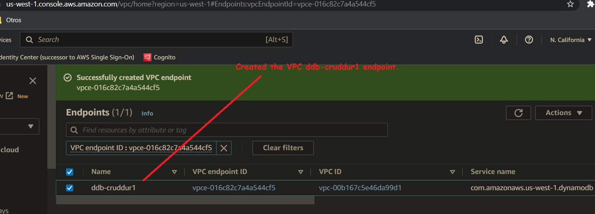

      
 ---
 
 >> ** Created the AWS Dynamo DB table.     
  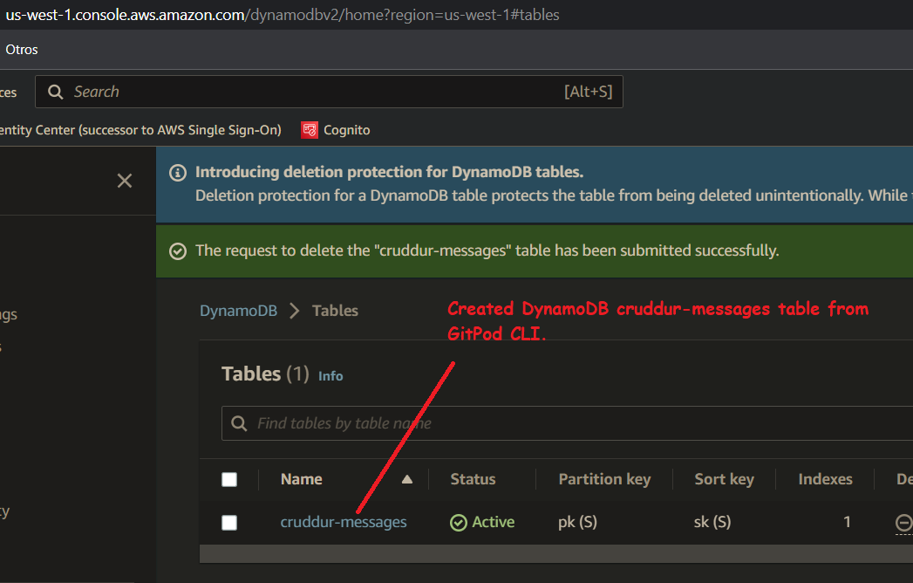

      
 ---
 
 >> ** Creating the prod table onto AWS by runningthe  schema-load file with the prod flag.     
  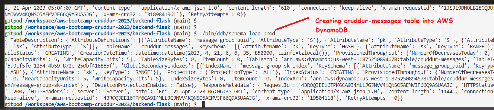
 
      
 ---
 
  >> ** Enabling the Dynamo DB stream for the cruddur-messages table.     
  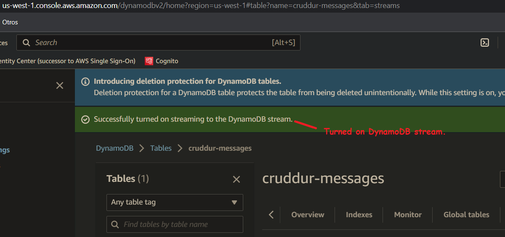
 
      
 ---
 
  >> ** Verifying that the stream trigger was created.     
  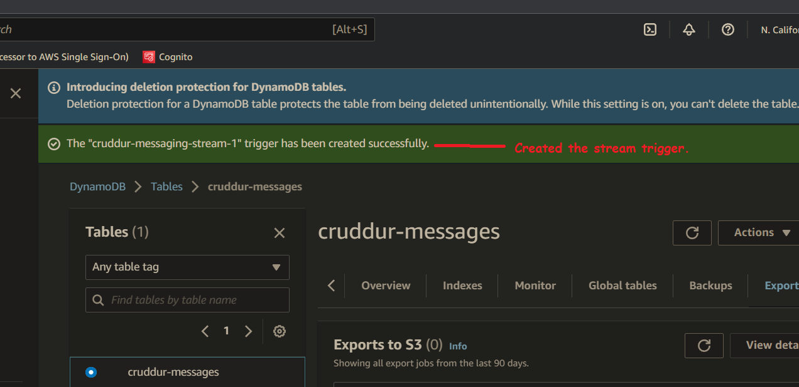
 
      
 ---
 
  >> ** ClickOps for creating the inline policy for the lambda function.     
  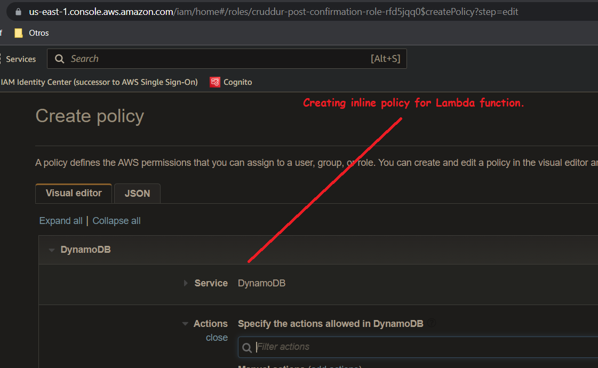
 
      
 ---
 
  >> ** Verifying the creation of the inline policy.     
  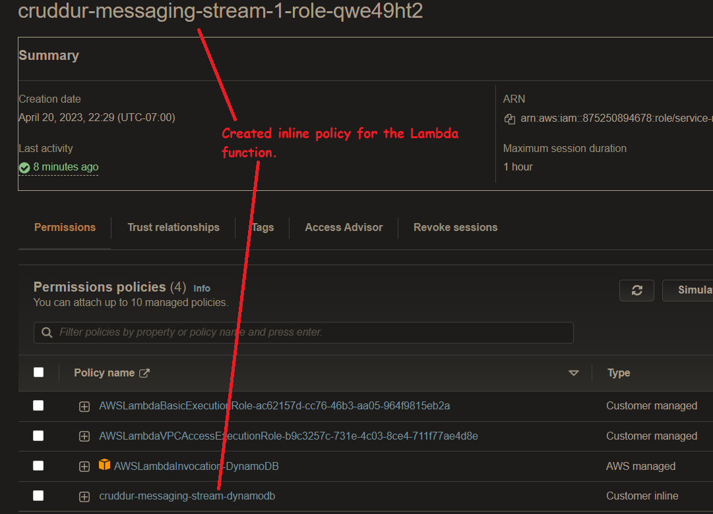
 
      
 ---
 
  >> ** Londo user is now working.     
  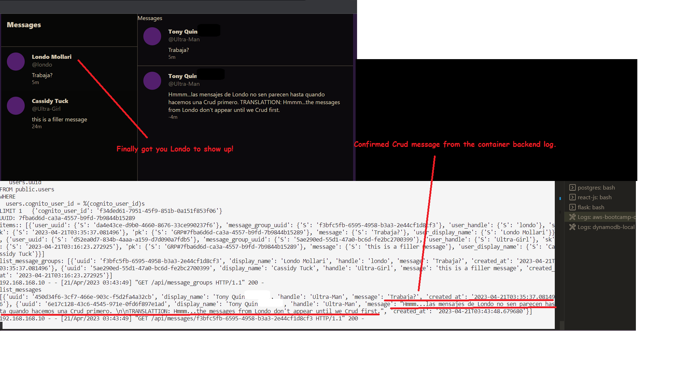
 
      
 ---
 
  >> ** Generating AWS Dynamo prod messages .     
  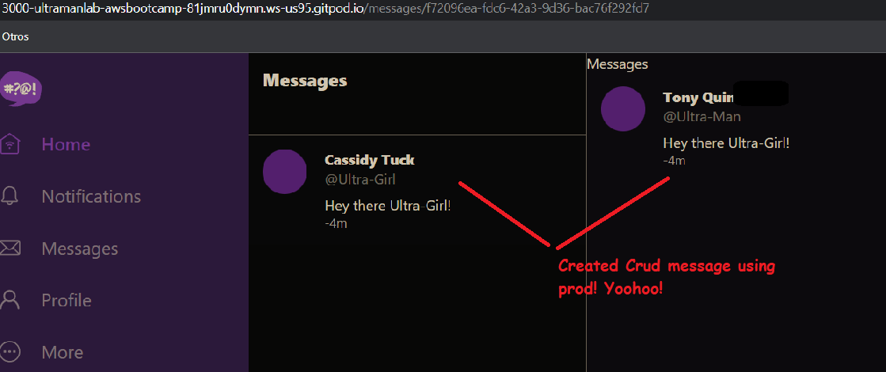
 
      
 ---
 
  >> ** Now using Cruddur app to test Londo messages on prod.     
  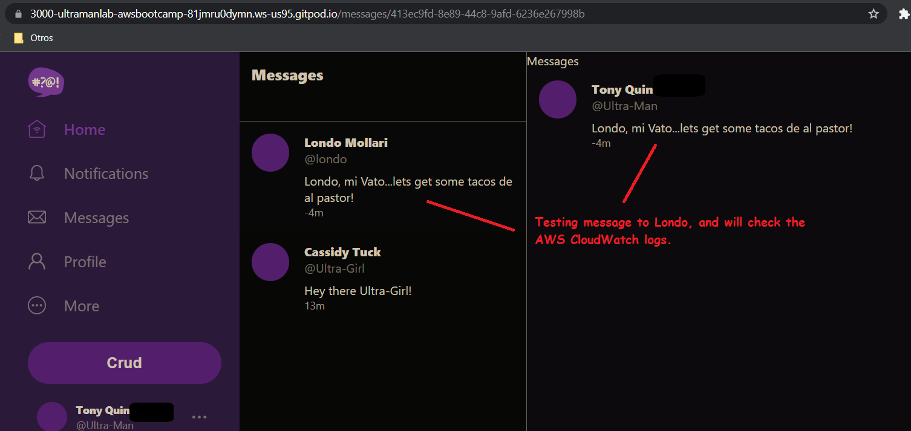
 
      
 ---
 
  >> ** CloudWatch logs for Cruddur messages appear to be good.     
  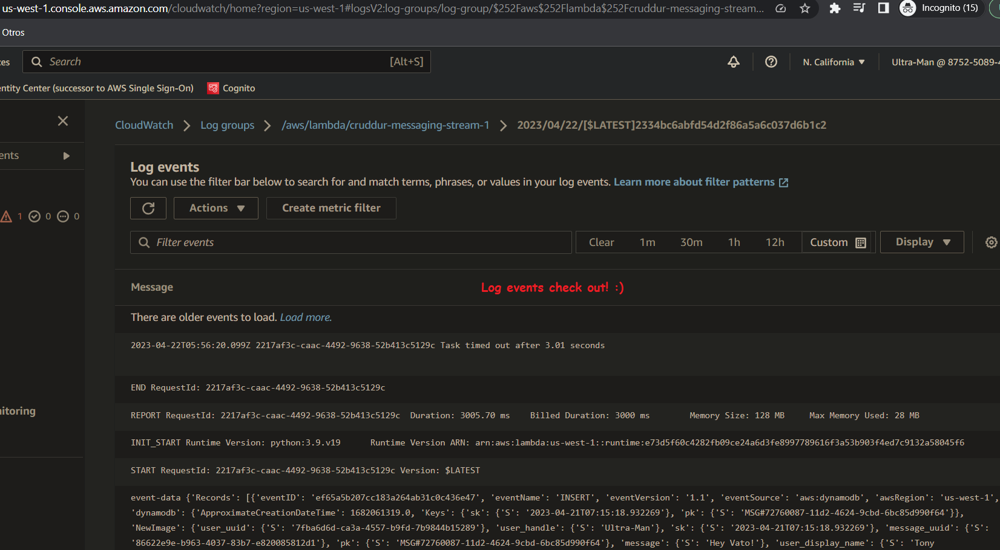
 
      
 ---
 
 
 
 
 
