# Week 5 — DynamoDB and Serverless Caching

## Ultra Man (Tony)

# Progress/reference and "Ah-ha" notes to self.
| *********************** |
| --- |
| * [Field Notes](https://github.com/ultraman-labs/aws-bootcamp-cruddur-2023/blob/main/_docs/assets/week5/Notes-Week5.txt) |
| --- |
| ** Backend directory cleanup. |
| --- |
| *  |
| --- |
| ** Updating seed file user handles.|
| --- |
| * 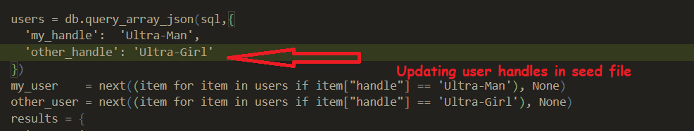 |
| * ---|
| ** Creating DB and loading schema.
| * ---|
| * 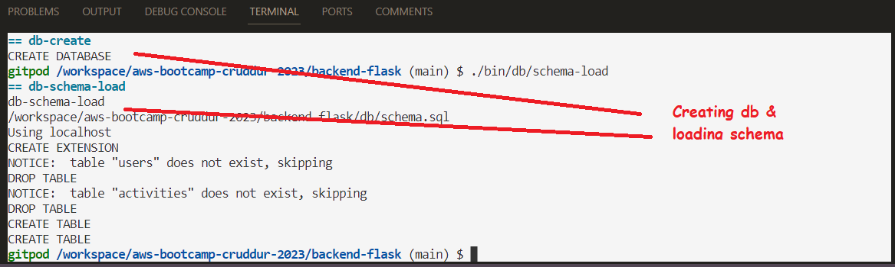 |
| * --- | 

 ---    
    **Seeding messages  

    
   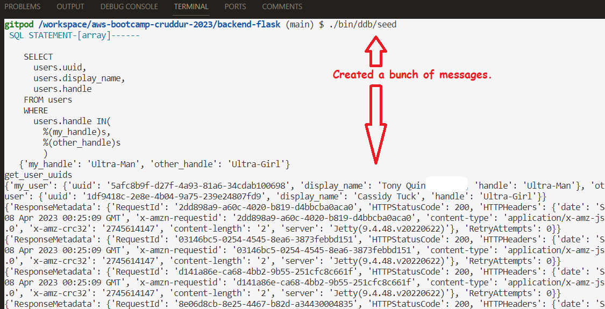        
   ---
  >> ** Running data scan.   
       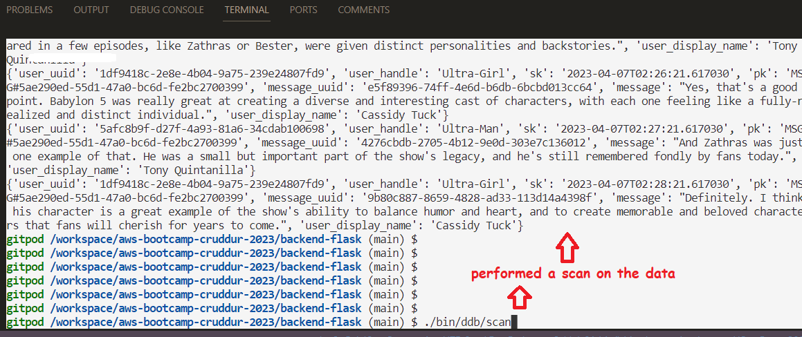
   
      
---

 >> ** Retrieving conversations.     
 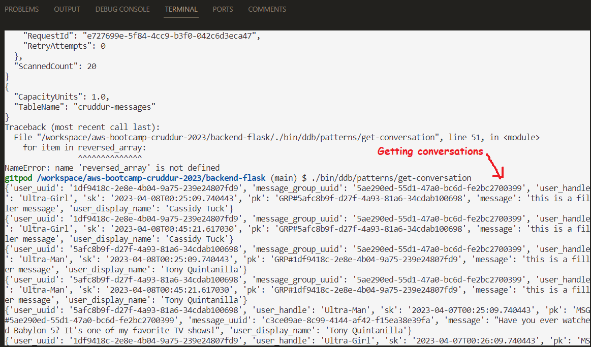 
 
       
 ---   
 
 >> ** Time format error.     
 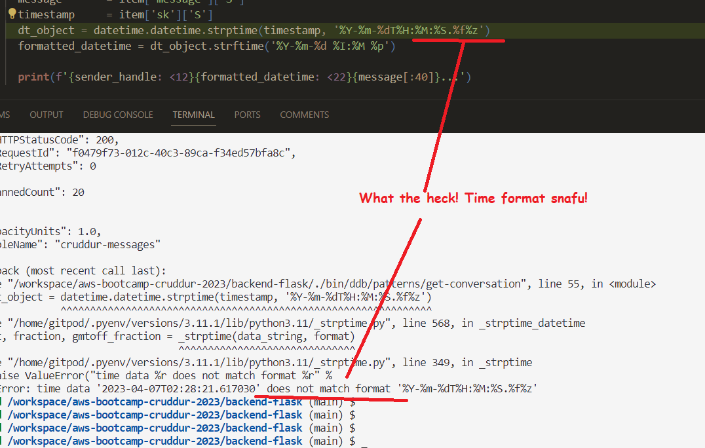 
 
       
 ---
>> ** Resolving the time format error.     
      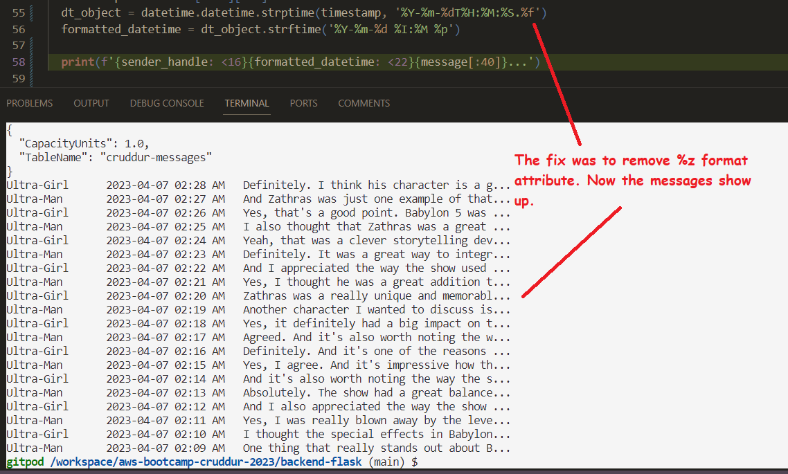 

      
 ---
>> ** Listing users.     
  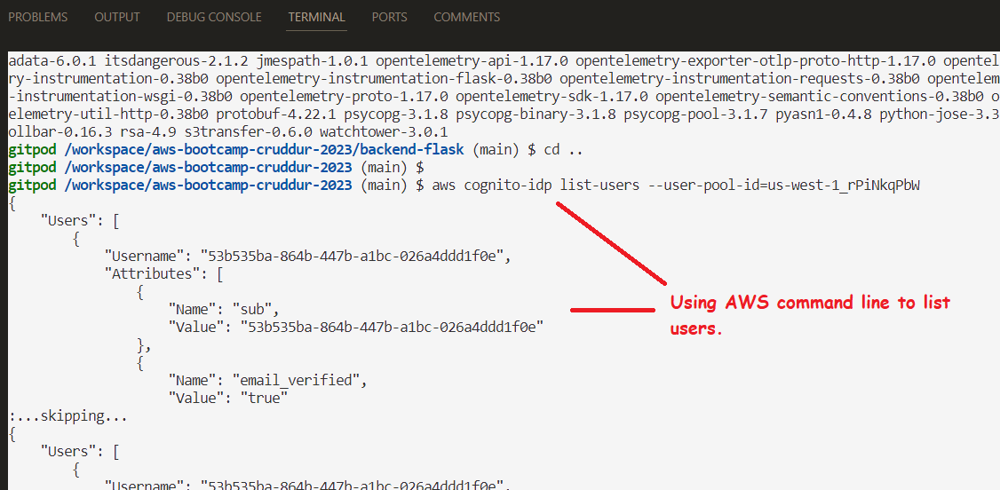

      
 ---

>> ** Exporting environmental variables.     
  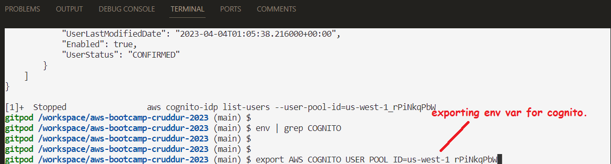

      
 --- 
 
 >> ** Changing file permissions.     
  

      
 --- 

>> ** Updating Cognito users ids and generating its output.     
  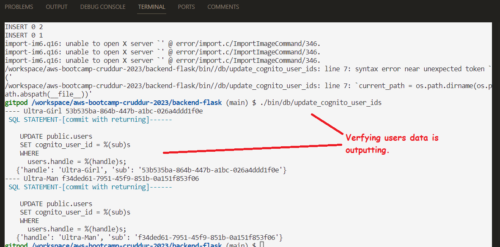

      
 --- 
 
 >> ** Error that "setCognitoErrors" is undefined.     
  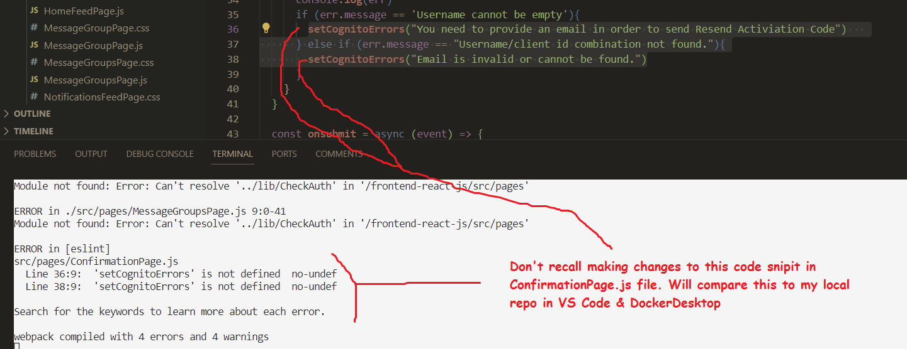

      
 --- 
 
 >> ** Resolved setCognitoErrors, with code change shown in pic.     
  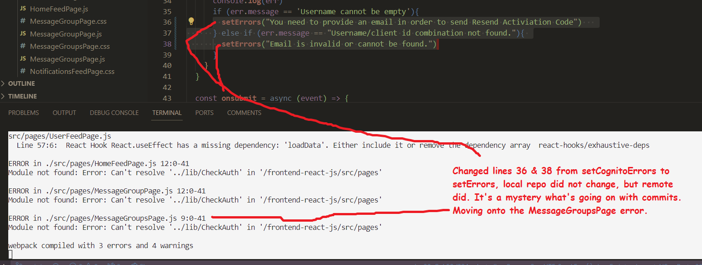

      
 ---

 >> ** The cause of this error was the referencing to a bash script.     
  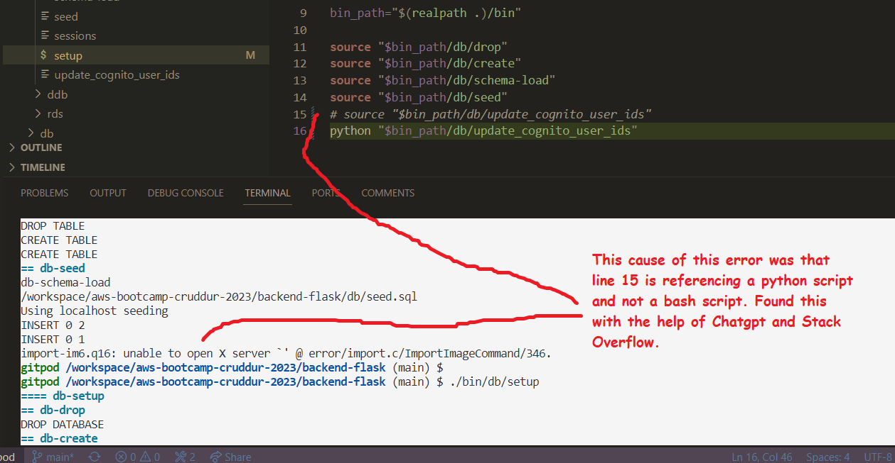

      
 ---

 >> ** Resolved this error by moving the file to the correct directory .     
  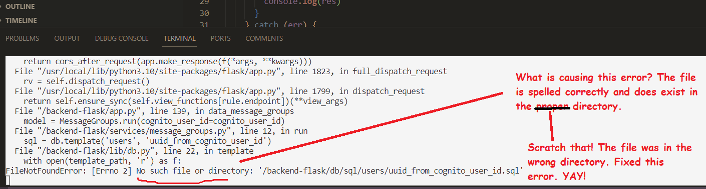

      
 ---

---

 >> ** Andrew explained this error, and the temp fix is to re-login.     
  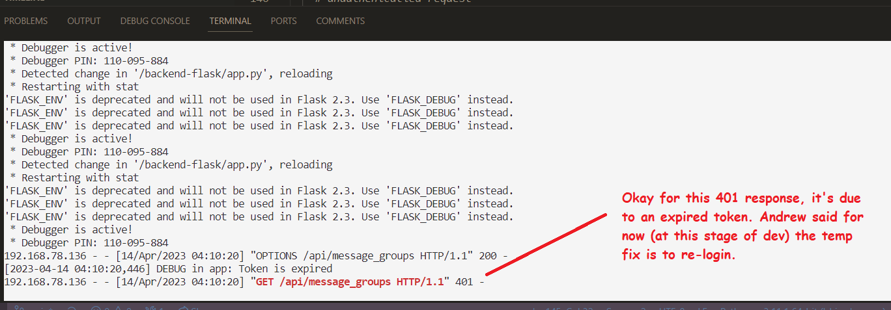

      
 ---
 
 ---

 >> ** Adding description to security group rule.     
  

      
 ---
 
 >> ** Retrieving email confirmation code.     
  

      
 ---
 
 >> ** Logging into Cruddur.     
  

      
 ---
 
 >> ** Logging into Cruddur.     
  

      
 ---
 
 >> ** Investigating CloudWatch logs for any errors. There were none!     
  

      
 ---
 
 >> ** Successfully retrieved new Cruddur users     
  

      
 ---
 
 >> ** Bingo! The Crud posted as expected.     
  
 
      
 ---
 
 
 
 
 
 
