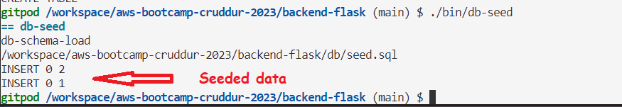
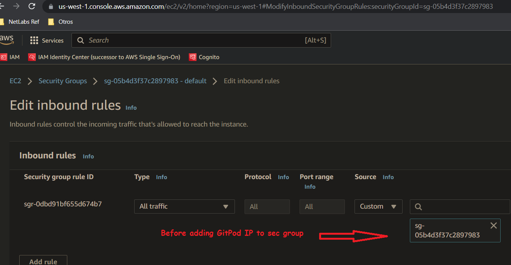

# Week 5 — DynamoDB and Serverless Caching

## Ultra Man (Tony)

# Progress/reference and "Ah-ha" notes to self.
| *********************** |
| --- |
| * [Field Notes](https://github.com/ultraman-labs/aws-bootcamp-cruddur-2023/blob/main/_docs/assets/week5/Notes-Week5.txt) |
| --- |
| ** Directory Cleanup |
| --- |
| *  |
| --- |
| ** Verifying the availbility zone for my region.|
| --- |
| *  |
| * ---|
| ** Listing the database before creating the Cruddur DB.
| * ---|
| *  |
| * --- | 

 ---    
    **Connect to postgres first, then create database buddy!  

    
           
   ---
  >> ** Moving towards automizing postgres password   
       
   
      
---

 >> ** Exporting the connection url to GitPod environment.     
  
 
       
 ---   
 
 >> ** Testing the bash db-drop script.     
  
 
       
 ---
>> ** Testing the bash db-create script.     
       

      
 ---
>> ** Testing the bash db-schema-load script.     
  

      
 ---

>> ** Testing the bash db-connect script.     
  

      
 --- 
 
 >> ** Using the command \dt to list the users and activities tables.     
  

      
 --- 

>> ** Seeding the data into the tables.     
  

      
 --- 
 
 >> ** False negative-- Cruddur DB instance did spin up successfully.     
  

      
 --- 
 
 >> ** Editing security group inbound rule for GitPod.     
  

      
 ---

 >> ** Testing the connection to the production database.     
  

      
 ---

 >> ** Listing production database.     
  

      
 ---

---

 >> ** Setting GitPod's environmental variables for DB security group identification.     
  

      
 ---
 
 ---

 >> ** Adding description to security group rule.     
  

      
 ---
 
 >> ** Retrieving email confirmation code.     
  

      
 ---
 
 >> ** Logging into Cruddur.     
  

      
 ---
 
 >> ** Logging into Cruddur.     
  

      
 ---
 
 >> ** Investigating CloudWatch logs for any errors. There were none!     
  

      
 ---
 
 >> ** Successfully retrieved new Cruddur users     
  

      
 ---
 
 >> ** Bingo! The Crud posted as expected.     
  
 
      
 ---
 
 
 
 
 
 
